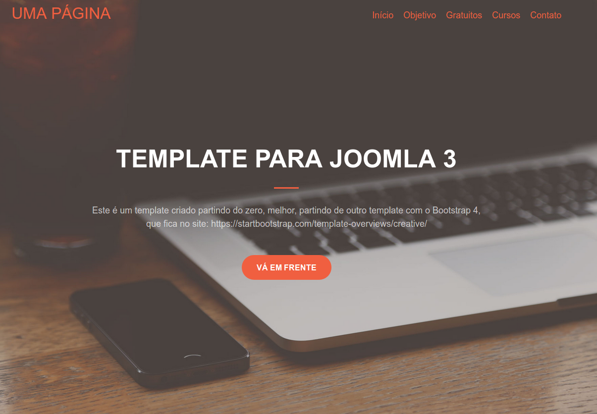

# Template para Joomla 3 usando o Bootstrap 4
Este tempalte é o resultado de meu aprendizado na construção de um templae do zero, ou seja, sem usar um framework de templales para Joomla, para que assim eu tenha mais controle e flexibilidade. Não conclui, mas já deu para sentir o gostinho do poder de mexer. 
Template para Joomla 3 de uma página partindo de um template para bootstrap 4.

## Sugestões
Serão muito bem vindas, juntamente com críticas construtivas, correções de algo e forks.

O template do qual eu parti foi um template bem bonito, profissional, que está aqui:

## Instalação
https://github.com/ribafs/template-uma-pagina

https://startbootstrap.com/template-overviews/creative/

Captura da tela inicial:

# Demo Online 
Este que criei ficou similar ao original abaixo

https://blackrockdigital.github.io/startbootstrap-creative/
